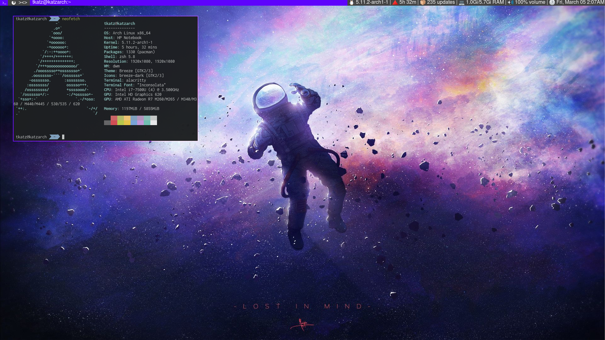

# dwm - dynamic window manager

dwm is an extremely fast, small, and dynamic window manager for X.

# Yet another config

List of [patches](https://dwm.suckless.org/patches/):
- autostart
- dwmblocks
- centermaster
- bottomstack
- alternativetags
- gridmode
- hide-vacant-tags

## Dependencies
- libxft-bgra
- ttf-joypixels (font for emoji)
